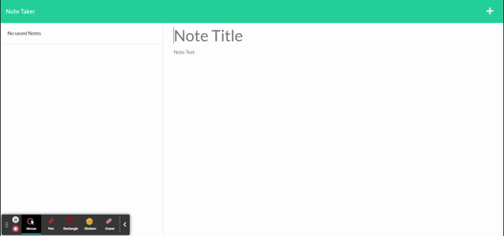

# note-taker-express

## Description 

This application was was built to aid small business owners in keeping their notes organized. With this app the user can easily make a note and save it. When task is accomplished the user can deleted it.

## Installation

To use this application go to the link provided:

https://express-note-taker5.herokuapp.com/notes

## Usage 

When user goes to link above they will be presented with a home page. The user should press the **Get Started** button to be taken to the note taking page.

Once on the note taking page the user can type their note title and text then click the save icon in the upper right hand corner.

Saved notes will appear on the left side of the screen. The user can click on a note to either view it or delete it.

## Credits 

I was able to build this app based off knowledge acquired in class, on the web, and from learning assistance.

